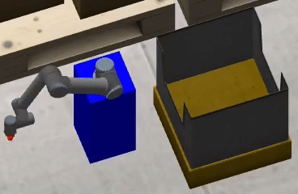

# Lecture 5 - MoveIt Basics

This lecture provides example of basic manipulation with MoveIt.



The [OMTP MoveIt config](omtp_moveit_config/) was generated by the use of `moveit_setup_assistant`.
```bash
roslaunch moveit_setup_assistant setup_assistant.launch
```

## Usage
Once build, the assignments can be executed with the following instructions.

First, setup the OMTP factory environment either in virual RViz or Gazebo.
```bash
# RViz
roslaunch omtp_moveit_config demo.launch
# Gazebo
roslaunch omtp_lecture5 omtp_lecture5_environment.launch
```

### Motion Planning with MoveIt Commander
Then run *MoveIt Commander* in another terminal.
```bash
rosrun moveit_commander moveit_commander_cmdline.py
```
> Note: If you experience problems during this step, make sure that `python` defaults to `python2`. If not, you can either use `alias` or change target of `/usr/bin/python` symlink adequately.

Once started, you can execute the command sequence by executing the following command.
```python
load /path/to/lecture5_assignment2_script
```

### Motion Planning with MoveIt Python Interface
You can also try the python interface of MoveIt by interpreting `lecture5_assignment3.py` script.
```bash
rosrun omtp_lecture5 lecture5_assignment3.py
```
