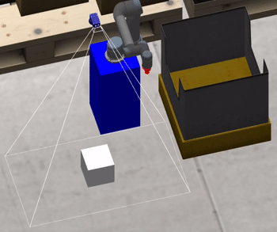
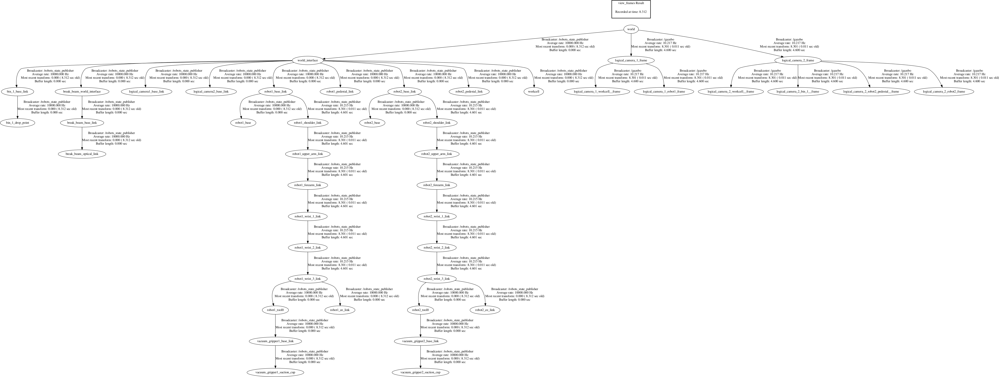

# Lecture 6 - Object Detection and Grasping

This lecture provides examples of detecting and grasping objects in Gazebo with the use of logical camera.

 


## Usage
Once build, the assignments can be executed, within the simulation tool Gazebo, with the following instructions.

```bash
# Assignment 3 - Transform object pose
roslaunch omtp_lecture6 lecture6_assignment3.launch
rosrun omtp_lecture6 lecture6_assignment3.py 
# Assignment 4 - Pick up objects
roslaunch omtp_lecture6 lecture6_assignment4.launch
rosrun omtp_lecture6 lecture6_assignment4.py 
```

### Generated TF structure
The following TF tree for assignment 2 was created with the following command.
```bash
rosrun tf view_frames
```



