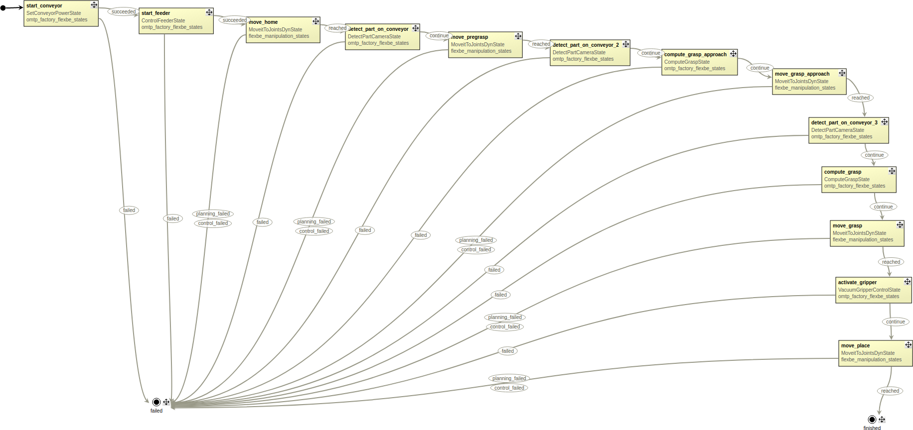

# Lecture 7 - Behavior Design with State Machines

This lecture provides an example of designing behaviour with state machines. FlexBE is utilised to design a state machine of manipulating a virtual Gazebo object by the use of MoveIt.




## Usage
Once build, the assignment can be executed with the following instructions.

First, setup the OMTP factory environment in Gazebo.
```bash
roslaunch omtp_gazebo omtp_pick_demo.launch
```

Then run FlexBE in another terminal, load the behaviour via GUI and run it.
```bash
roslaunch flexbe_app flexbe_full.launch
```
