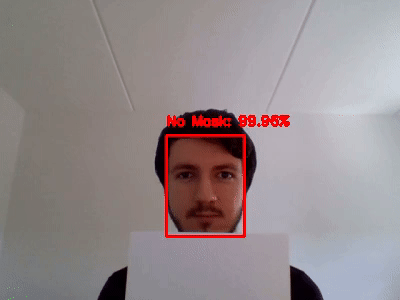
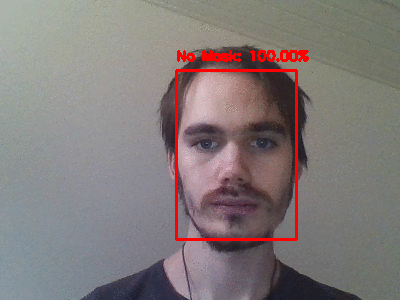

# Lecture 8 - CNNs in Practical Robotic Applications

This lecture demonstrates the use of Convolutional Neural Networks (CNN) in robotic applications. Here is an example of detecting face masks, which is implemented by [covid19_mask.ipynb](covid19_mask.ipynb). It was trained and tested by the use of [Google Colab](https://colab.research.google.com).

