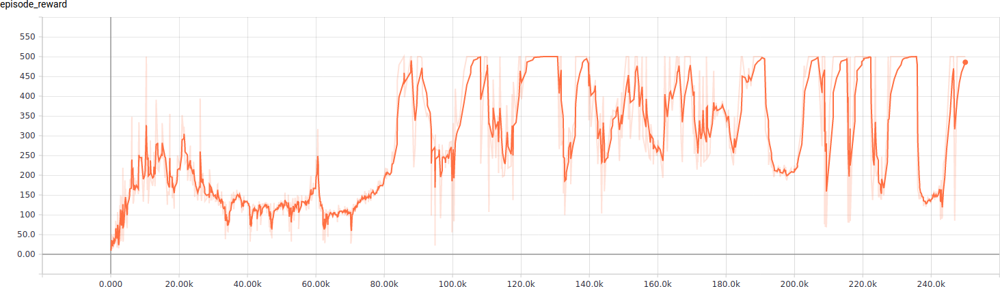

# Lecture 9 - Deep Reinforcement Learning for Robot Control

This lecture provides contains a simple example of robot control by the use of deep reinforcment learning. Here, an inverted pendulum is trained to balance on its own.


## Dependencies

Please install [OpenAI Gym](https://gym.openai.com/), [Tensorflow<=1.15.0](https://www.tensorflow.org/tensorboard) and [Stable Baselines](https://stable-baselines.readthedocs.io) with its requirements.

```bash
sudo apt-get install -y libopenmpi-dev zlib1g-dev
pip3 install gym
pip3 install tensorflow==1.15.0
pip3 install stable-baselines
```

## Usage
The following script can interpreted to train the model and view the resulting animation.
```bash
python3 cartpole.py
```

Hereafter, `tensorboard` can be used to view the learning process and additional information. For example, below is a graph of the reward after each episode.


